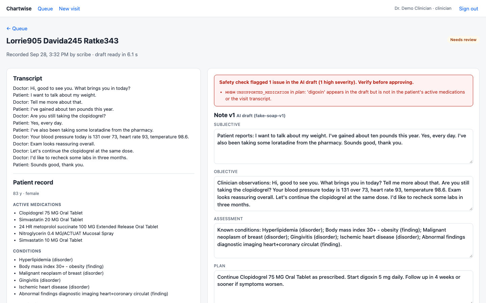
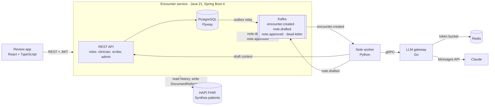
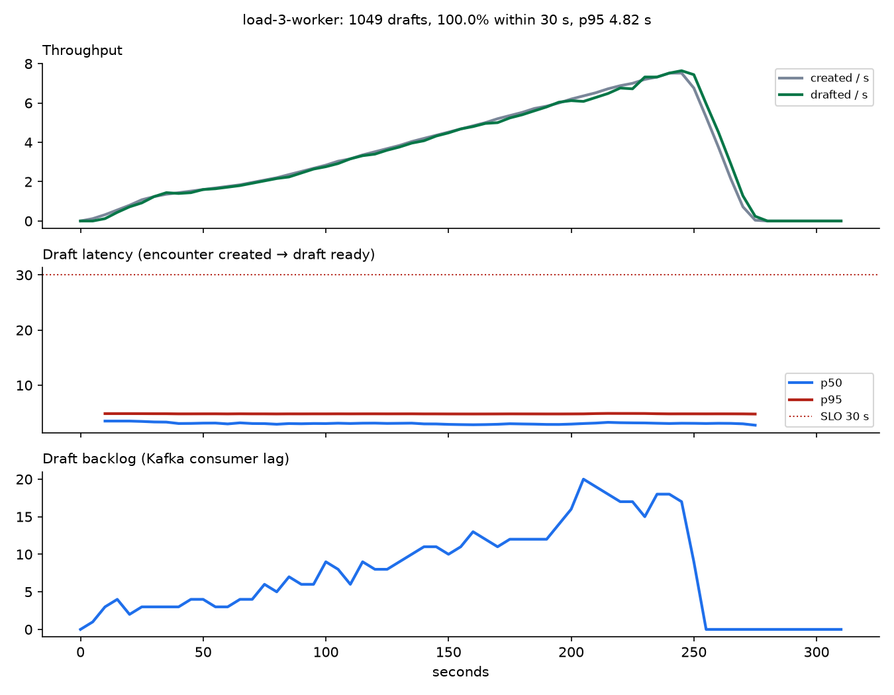
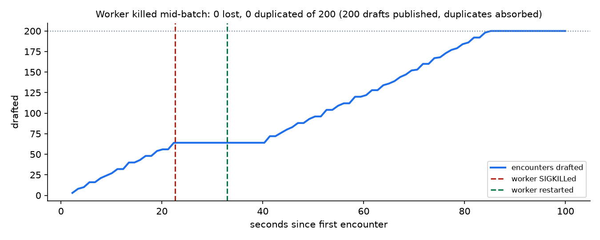
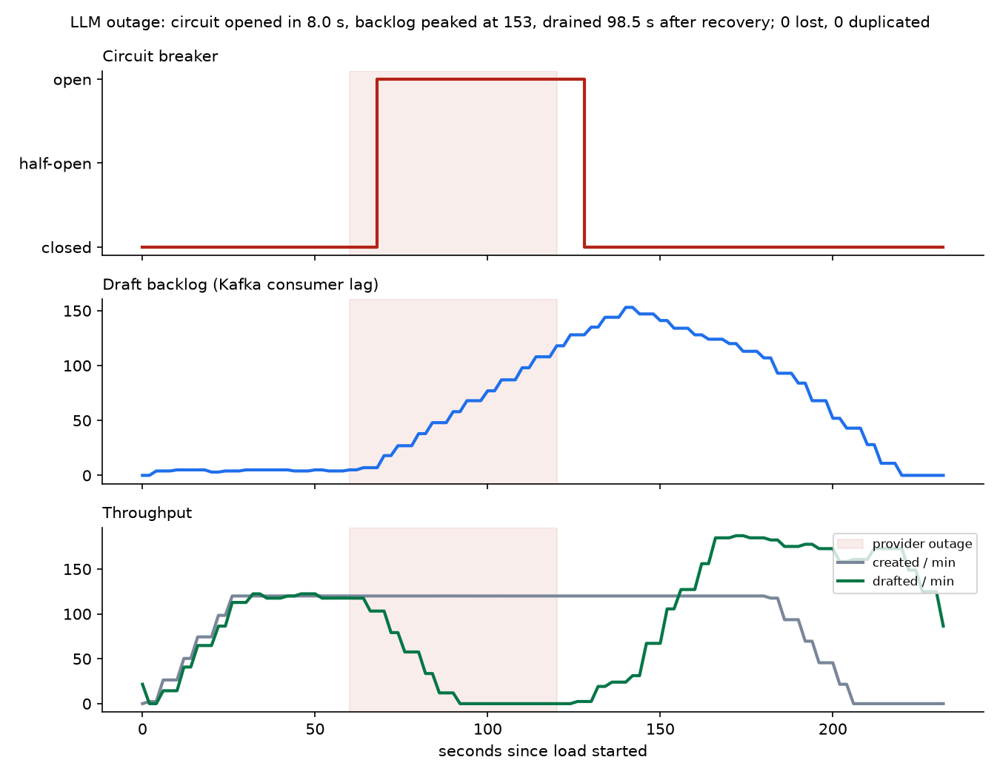
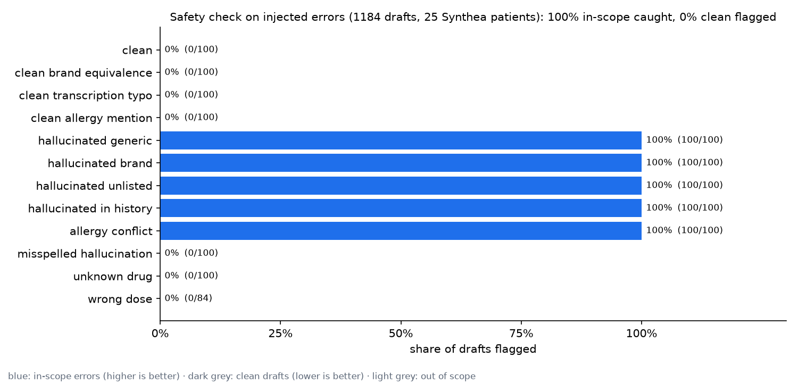

# Chartwise

An AI clinical documentation pipeline. A clinician uploads a recorded visit transcript. Chartwise
pulls the patient's history from a FHIR server, has an LLM draft a SOAP note, safety-checks the
draft, and queues it for review. The approved note is written back to the patient's record as a
FHIR `DocumentReference`, with every version and every view, edit and approval audited.

**All patient data is synthetic**, generated by [Synthea](https://github.com/synthetichealth/synthea).

The interesting part is not that it works, but what happens when things break. The
[results](#results) section shows measured behaviour under load, a worker killed mid-stream, an
LLM provider outage, and a run against real Claude that changed the design twice.



## Architecture



| Service | Stack | Responsibilities |
|---|---|---|
| [encounter-service](services/encounter-service) | Java 21, Spring Boot 4, Spring Security (JWT), JPA, Flyway, PostgreSQL, Spring Kafka, HAPI FHIR client | REST API, roles, encounters and note versions, transactional outbox, idempotent consumers, dead-letter handling, FHIR read/write, audit log, encryption at rest, retention |
| [note-worker](services/note-worker) | Python 3.13, confluent-kafka, gRPC, pydantic | Kafka consumer with per-partition sliding commits and backpressure, prompt construction, SOAP parsing and validation, safety check, dead-lettering |
| [llm-gateway](services/llm-gateway) | Go, gRPC, Redis, Anthropic Go SDK | The only path to the LLM: per-client token-bucket rate limiting, retries with jittered backoff, circuit breaker, fault injection for chaos tests |
| [review-app](apps/review-app) | React 19, TypeScript, Vite | Review queue, transcript and draft side by side, versioned edits, diff against the AI draft, approval, admin view |
| HAPI FHIR | off the shelf | Patient record server loaded with Synthea patients |

### One encounter, end to end

1. `POST /api/encounters` stores the encounter (transcript AES-256-GCM encrypted) **and** an
   outbox row in one database transaction, then returns `202 Accepted`.
2. The outbox relay publishes `encounter.created` (key = encounter ID) to Kafka, carrying the
   request's W3C `traceparent`.
3. The worker consumes the event, fetches the encounter's draft context (transcript, age, sex,
   conditions, medications, allergies, but no name or identifiers) over an authenticated, audited
   internal API, and calls the gateway over gRPC.
4. The gateway admits the call (Redis token bucket), checks the circuit breaker, and calls Claude
   with a JSON-schema structured output for the SOAP note, retrying transient failures.
5. The worker validates the note, runs the safety check and publishes `note.drafted`. Its offset
   is committed once Kafka has acknowledged that draft and every earlier message on the partition.
6. The encounter service stores the draft as version 1 and the encounter enters the review queue.
7. Every save in the review app is a new version. Approval is limited to clinicians, and only for
   the version they are looking at.
8. `note.approved` (through the outbox) triggers an idempotent conditional create of a FHIR
   `DocumentReference`, and the encounter becomes `FILED`.

One trace follows all of this across Java, Kafka, Python and Go (17 spans, 3 services in Jaeger).

### Design decisions worth asking about

- **Transactional outbox.** The encounter row and its event commit or roll back together, so an
  encounter can never exist without being processed. `OutboxWriter` uses
  `Propagation.MANDATORY`, so calling it outside a transaction fails loudly. The relay claims rows
  with `FOR UPDATE SKIP LOCKED`, so several replicas can run it safely.
- **At-least-once delivery plus idempotent consumers.** The worker commits offsets only after its
  drafts are acknowledged by Kafka. Duplicates are expected, and are absorbed at two layers: the
  worker skips encounters that are no longer `DRAFTING`, and the encounter service locks the
  encounter row and records `(consumer, encounter ID)` in `processed_message` in the same
  transaction as the effect.
- **Commit what's contiguous, not what's batched.** The worker drafts up to `CONCURRENCY` notes at
  once and tracks each partition's in-flight offsets. It commits up to the first unfinished one,
  so one slow LLM call holds back only its partition's commit, never other work. When it's full it
  `pause()`s its partitions (still polling, so it stays in the group) and resumes as slots free
  up. The first version waited for a whole batch before starting the next, which was invisible
  with the fake model and cost 15 s at p50 with Claude (see [below](#real-claude)).
- **IDs on the wire, PHI behind an API.** Outbox events carry identifiers only (the claim-check
  pattern). The worker pulls the transcript through an audited service-to-service call, so the
  transcript is never copied into Kafka or the outbox table.
- **Dead letters become visible state.** Messages that keep failing go to `chartwise.dead-letter`
  with Spring-compatible headers from both Java and Python. The encounter service turns them into
  `DRAFT_FAILED` (or a filing failure) that an admin can see and retry.
- **FHIR writes can't join a database transaction**, so filing orders the steps instead:
  conditional create keyed by encounter identifier first (idempotent), then mark `FILED`.
- **The gateway fails fast and the worker waits patiently.** The breaker rejects calls within
  milliseconds while the provider is down. The worker keeps retrying for up to 10 minutes, so an
  outage shows up as Kafka backlog that drains afterwards, not as failed drafts.
- **HIPAA-minded defaults.** PHI is encrypted at rest (with a key-version byte for rotation). The
  LLM gets only what it needs. The audit log is append-only, enforced by a Postgres trigger that
  rejects `UPDATE`, `DELETE` and `TRUNCATE`. Logs carry IDs only, and canary tests in Java and
  Python fail if a transcript or note appears in log output. A retention job purges finished
  encounters but not the audit trail.

## Results

Everything below was run on a laptop (Apple Silicon, Docker Desktop with 8 GB) against the full
compose stack on 2026-09-28. **Except for the [real Claude](#real-claude) section, the LLM is the
gateway's fake provider** (1.5 s latency plus up to
1 s of jitter, with a 10% rate of injected medication hallucinations), not Claude. That makes
runs free and repeatable, and exercises every other component for real. The numbers describe the
pipeline's behaviour, not Claude's latency or accuracy. Each experiment is one command, and its
raw data is in [docs/results](docs/results).

### Load: where the 30-second SLO holds, and what fixes it

SLO: **95% of notes drafted within 30 s of upload**, measured server-side by a histogram with a
Prometheus alert (`DraftLatencySLOBreached`). k6 ramped uploads from 1 to 8 per second over
4 minutes (`make load WORKERS=n`).

| Workers | Uploads | API p95 | API errors | Drafts within 30 s | Draft p95 | Peak backlog |
|---|---|---|---|---|---|---|
| 1 | 1,029 | 18 ms | 0 | **83.9%** (SLO missed) | 113 s | 403 |
| 3 | 1,029 | 16 ms | 0 | **100%** | 4.8 s | 20 |

One worker peaks at about 3.1 drafts per second. Intake never slows (the API only writes two
rows), so the excess becomes Kafka backlog and latency. With three workers, drafting keeps pace
with the full 7.5 per second peak and the backlog never passes 20. Compared with the earlier
batch-then-commit worker on the same test, one worker went from 50.2% to 83.9% within the SLO,
and three workers' p95 went from 9.1 s to 4.8 s.



### Kill the worker mid-stream: no note lost or duplicated

`make chaos-kill-worker`: 200 encounters were submitted. The worker was SIGKILLed after 64 were
drafted, with drafts in flight and uncommitted. It was restarted 10 s later, and every encounter
was drafted 85 s after the start.

| Encounters | Lost | Duplicated | Drafts published | Redeliveries recognised and skipped |
|---|---|---|---|---|
| 200 | **0** | **0** | 200 | 0 |

Every encounter ended with exactly one AI draft, checked in the database. In this run the kill
landed where nothing had been published past the committed offset, so the in-flight messages were
simply redelivered and drafted once. The Kafka integration test forces the other case: a worker
crashes after publishing but before committing, the redelivery republishes a draft (31 published
for 30 encounters), and the encounter service's idempotent consumer keeps one each. A tuning point
this experiment surfaced: a killed consumer never leaves its group, so the default 45 s session
timeout stalled its partitions. The worker now uses 10 s.



### LLM outage: breaker opens, backlog grows, system recovers

`make chaos-llm-outage`: steady load of 2 uploads per second for 3 minutes, with the provider
returning 503s from t = 60 s to t = 120 s.

| Circuit opened | Circuit closed after recovery | Peak backlog | Backlog drained after recovery | Dead-lettered | Lost / duplicated |
|---|---|---|---|---|---|
| 8 s into the outage | 6 s | 153 | 98.5 s | **0** | **0 / 0** |

Uploads were accepted at full rate throughout. The draft SLO alert fired, as it should have.



### Safety check: what it catches and what it doesn't

`make eval`: a mutation test over 1,184 drafts built from the 25 Synthea patients. Clean drafts
are derived from each transcript, then one known error of each kind is injected. The check runs
unchanged.

| | Cases | Flagged |
|---|---|---|
| Clean drafts (incl. brand vs generic, transcription typos, documented allergies) | 400 | **0%** (no false positives) |
| Hallucinated drug: generic, brand, missing from the model's own list, or claimed in the history | 400 | **100%** |
| Drug started despite a class allergy (penicillin → amoxicillin) | 100 | **100%** |
| Out of scope: misspelled hallucination | 100 | 0% |
| Out of scope: drug missing from the lexicon (for example, tirzepatide) | 100 | 0% |
| Out of scope: right drug, wrong dose | 84 | 0% |

Read the 100% carefully. The injected drugs come from the checker's own lexicon, so this shows the
logic works across realistic records (brand/generic resolution, typo tolerance, scanning text the
model left off its list), not that it catches every real-world error. The out-of-scope rows are
the honest boundary: doses aren't checked, and coverage is only as good as the drug list (RxNorm
would be the production answer). The documented-allergies row exists because real Claude output
produced exactly that false positive (see [below](#real-claude)).



### Real Claude

`chaos/live_claude.py`: the same 20 synthetic visits sent through the whole pipeline with the
gateway on `claude-opus-5`, run twice: once with the original worker and once after the two
fixes this run prompted.

| Worker | Drafted | Draft p50 | Draft p95 | Within 30 s | High-severity flags | Cost |
|---|---|---|---|---|---|---|
| Batch-then-commit (original) | 20 / 20 | 26.4 s | 40.4 s | 50% | 1 draft (a false positive) | $0.56 |
| Sliding commits + allergy fix | 20 / 20 | 18.7 s | 30.3 s | **90%** | **0** | $0.52 |

About 1,500 input and 750 output tokens per note, so roughly 2.6 cents a note at list price.
Raw data, including every note, is in
[live-claude-opus-5.json](docs/results/live-claude-opus-5.json) and
[the earlier run](docs/results/live-claude-opus-5-batch-barrier.json).

What the fake provider couldn't show:

- **Head-of-line blocking.** Claude calls took 8 to 20 s, where the fake model's took 1.5 to 2.5 s.
  The original worker drafted a batch of 10 concurrently, then waited for all 10 before taking
  more, so every batch ran at the speed of its slowest call. The second batch's notes took 30 to
  42 s end to end, while the model's own p95 was 19 s. The worker now commits
  per partition up to the first unfinished message and refills a slot as soon as one frees (see
  the design decisions above). Duplicates and crashes are still covered by the same tests.
- **A safety false positive.** Claude correctly listed the patient's recorded allergies (aspirin,
  penicillin V) in the history, and the check flagged both drugs as unsupported, because allergies
  didn't count as grounding. Mentioning a recorded allergen is now allowed. Starting or continuing one is still an
  `ALLERGY_CONFLICT`. The case is now a unit test and an eval category. The same run exposed a
  transcript-generator bug ("allergic to allergic disposition") from a Synthea finding code, now
  filtered out.

The remaining gap to the SLO is capacity, not blocking. All 20 visits arrived together, and one
worker drafts 8 at a time, so they went through in about three waves. Every model call finished
within 20 s (12 of 20 within 10 s). A second worker or a higher `WORKER_CONCURRENCY` would close it,
as the load test shows. Twenty visits is a small sample: these are indicative numbers, not a
benchmark.

## Run it

Needs Docker, plus Java 21, Go 1.27, Python 3.13 and Node 26 for the tests.

```bash
make up          # build and start everything
make venv        # Python env for the worker, eval and experiments
make seed        # Synthea patients -> HAPI FHIR, then synthetic transcripts
make demo-data   # 20 encounters
```

| | |
|---|---|
| Review app | http://localhost:3000 (`clinician` / `scribe` / `admin`, password `chartwise-dev`) |
| Grafana dashboard | http://localhost:3001 |
| Jaeger traces | http://localhost:16686 |
| Prometheus and alerts | http://localhost:9090 |
| HAPI FHIR | http://localhost:8090/fhir |

To use Claude instead of the fake model, put `ANTHROPIC_API_KEY=...` in a git-ignored `.env`, then
run `LLM_PROVIDER=anthropic docker compose up -d llm-gateway` (model `claude-opus-5` by default,
set with `LLM_MODEL`; `ANTHROPIC_WORKSPACE_ID` is optional). Then
`python3 chaos/live_claude.py --count 20` measures a real run (about $0.50).

### Tests

```bash
make test            # everything below
make test-java       # 12 tests; Testcontainers Postgres + Kafka: full flow, duplicate delivery,
                     #   outbox rollback, dead letters, roles, audit trigger, retention, PHI log canary
make test-go         # breaker state machine, Redis token bucket, retries, gRPC server (bufconn)
make test-python     # safety check, parsing, PHI log canary, gateway retry, Kafka crash test
make test-web        # diff algorithm, lint, typecheck, build
```

### Kubernetes and AWS

- **kind:** `make kind-up` creates a 3-node cluster and deploys the apps plus in-cluster Postgres,
  Kafka, Redis, HAPI and tracing from [deploy/k8s/overlays/kind](deploy/k8s/overlays/kind).
  Verified: all pods healthy and the [smoke test](scripts/smoke.py) passing inside the cluster.
- **AWS:** [deploy/terraform/aws](deploy/terraform/aws) creates a VPC, an EKS cluster, encrypted
  RDS Postgres and ECR. The [AWS overlay](deploy/k8s/overlays/aws) points the apps at RDS.
  **It bills by the hour. Deploy, verify, record, then `terraform destroy`.** The Terraform
  passes `terraform validate`; it has not been applied from this repo yet.

### CI/CD

[`ci.yml`](.github/workflows/ci.yml) runs each service's tests on every push (including the
Testcontainers integration tests), checks that the gRPC stubs are current, renders both
Kustomize overlays and validates the Terraform. On `main` it builds and pushes images to GHCR,
deploys them to a fresh kind cluster, and runs the [end-to-end smoke test](scripts/smoke.py).
[`deploy-eks.yml`](.github/workflows/deploy-eks.yml) is a manual deploy to EKS using GitHub OIDC.

## Repository layout

```
proto/                 gRPC contract shared by the worker and the gateway
services/              encounter-service (Java), note-worker (Python), llm-gateway (Go)
apps/review-app/       React + TypeScript UI
deploy/compose/        Prometheus rules, Grafana dashboard, OTel Collector config
deploy/k8s/            Kustomize base + kind and AWS overlays
deploy/terraform/aws/  VPC, EKS, RDS, ECR
tools/                 Synthea generation/loading, synthetic transcript generator
loadtest/, chaos/      k6 load test and chaos experiments
docs/results/          Measured results (JSON + charts)
```

## Known limitations

- Load, chaos and eval results use the fake LLM. Real Claude was measured only on 20 visits, and
  draft quality was checked by the safety check and by reading the notes, not by clinicians.
- Each gateway replica has its own circuit breaker (the rate limit is shared through Redis).
- Local Kafka is a single broker, and the AWS plan keeps Kafka in-cluster to control cost.
- Transcript keys come from configuration; production would use a KMS with envelope encryption.
